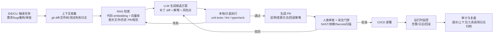
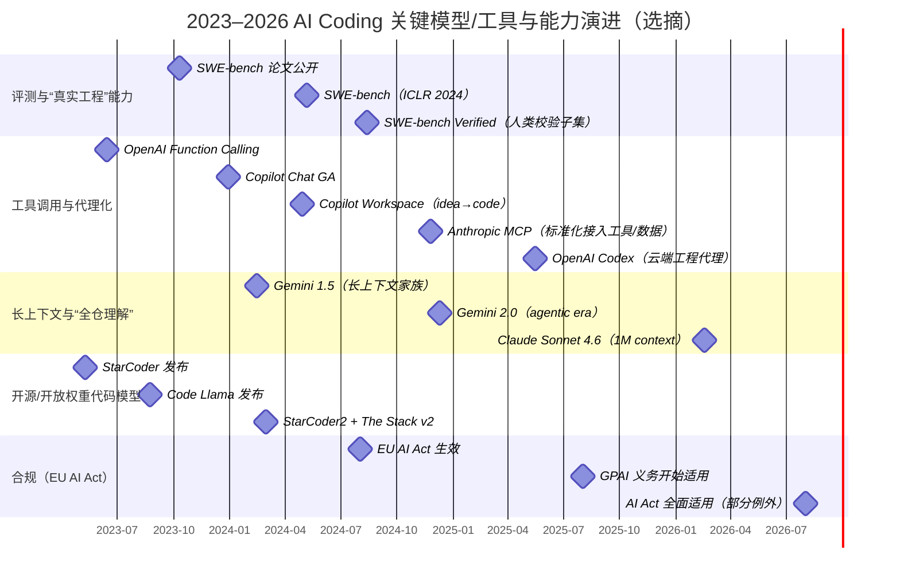

+++
date = '2026-03-25T20:15:00+08:00'
draft = false
title = 'AI Coding：一些观察'
description = "关于模型、工具和软件开发流程的笔记"

categories= ["AI Coding"]
tags= ["AI", "Agent"]

image = 'cover.png'
+++

作为一名软件工程师，我们对AI自然不会陌生，但我如今愈发感受到软件行业正在被AI逐渐改变，甚至可能彻底颠覆，写代码这件事，正在变化。

## 整体视角

过去三年（2023–2026）AI Coding 的主线变化可以概括为：**从“补全代码（autocomplete）”走向“对话式协作（chat copilot）”，再走向“具备检索、执行与审计能力的工程代理（agentic coding）”**。这一变化并非单纯来自模型“更大”，而是来自一整套工程能力的系统化：长上下文/检索增强（RAG）、结构化工具调用、指令与偏好对齐（SFT/RLHF/DPO 等）、以及更加贴近真实工程任务的评测体系（以 SWE-bench 为代表）。

- **技术演进的“最关键拐点”**：  
  1)真实工程任务评测兴起（SWE-bench 2024；SWE-bench Verified 2024）让“能否在真实仓库里修 issue、跑测试、提 PR”成为更重要的能力标尺；2)工具调用与沙盒执行（函数调用、代理沙箱、并行任务）使模型从“写代码”升级为“做工程”
- **产业化形态的“平台化拐点”**：  
  2024–2026 主流厂商把能力从模型层下沉到“IDE/CLI/PR 工作流 + 组织知识接入 + 审计与合规”，并出现多模型路由与代理化产品（如 Codex、Claude Code、Copilot Workspace、Gemini Code Assist 等）

- **典型的AI Coding工作流**：  
  RAG/代码索引提供“可解释的上下文来源”，测试与静态分析提供“可执行的质量证据”，审计日志提供“事后可追踪”。

## 技术演进关键里程碑梳理

| 时间 | 里程碑（技术/产品/评测） | 技术要点（架构/数据/对齐/评测） | 对 AI Coding 的影响评估（工程视角） |
|---|---|---|---|
| 2020 | 代码语义表征（如 CodeBERT） | 以“代码+自然语言”联合预训练学习 code embedding，可用于代码搜索、文档生成等（Feng 等，2020）。| 形成后续“语义检索/RAG/代码知识库”的底层能力组件（尤其在企业私有仓库）。 |
| 2021 | HumanEval 与“代码模型评测范式” | HumanEval 用可执行单元测试评估代码生成，并引入 pass@k 等指标（Chen 等，2021）。 | 把评测从“文本相似度”推进到“能否跑过测试”，成为后续 SWE-bench 的前置范式。 |
| 2022 | RLHF 走向主流（InstructGPT） | “指令微调 + 人类偏好强化学习”把基础模型转为可用助手（Ouyang 等，2022）。 | AI Coding 从“补全”走向“对话式协作”：可解释意图、遵循规范、输出结构更稳定。 |
| 2022–2023 | 指令调优体系扩展（IT/SFT、DPO 等） | 指令调优（Instruction Tuning/SFT）成为通用做法（Zhang 等，2023）；偏好优化出现更简化的 DPO 路线（Rafailov 等，2023；OpenAI，2025）。 | 促成“可控输出格式”“更强遵循规范/风格/安全策略”，适配代码审查与自动化流水线。 |
| 2023-03 | GPT-4 发布 | 官方技术报告强调训练过程与评测方法，但未披露参数规模等细节（OpenAI，2023）。 | 商用代码助手能力显著提升，成为 2023–2024 多数 Copilot/IDE 方案的能力上限参照。 |
| 2023-06 | 函数调用（Function Calling）与工具协作 | 模型输出符合函数签名的 JSON 参数，从而可安全连接外部工具；官方亦提示“工具输出中的不可信数据可能诱导模型误操作”，需要信任边界与确认步骤（OpenAI，2023）。 | 让 AI Coding 从“写代码片段”转向“可编排的工程动作”：检索、创建 PR、跑测试、发邮件等都可纳入链路。 |
| 2023-05 / 2024-02 | 透明开源代码模型体系（StarCoder → StarCoder2） | StarCoder（15.5B，OpenRAIL-M）与 StarCoder2（3B/7B/15B），强调数据治理、透明度、以及在 The Stack v2 上训练（BigCode，2023–2024）。 | “可本地部署 + 可审计数据来源”成为企业自建/私有化的可行路径，但需理解 OpenRAIL 等“非 OSI 开源”许可的合规边界。 |
| 2023-08 | Code Llama（Meta）发布 | 强调代码专用训练、并引入填空式 infilling（FIM）能力用于“中间插入代码”，对重构/补丁场景更贴近（Meta，2023）。 | 推动业界把“补丁生成（diff/patch）与 infill”当作 AI Coding 的核心交互形式之一。 |
| 2023–2024 | 真实工程任务评测转向（SWE-bench / Verified） | SWE-bench 以真实 GitHub issue/PR 构造 2294 个任务，要求模型在真实仓库上下文修改代码并通过测试；论文指出早期 SOTA 在该任务上成功率极低（Jimenez 等，2024）。 | 直接推动“代理 + 执行环境 + 测试驱动”的产品化路线：没有可执行验证链路的纯生成体系很难在真实工程落地。 |
| 2024-05 / 2024-02 / 2026-02 | 长上下文成为“工程级能力” | Gemini 1.5 宣布 1M–2M token 级上下文（Google，2024）；Claude Sonnet 4.6 宣布 1M token 上下文可容纳“整个代码库”（Anthropic，2026）。 | 让“整仓理解、跨文件重构、长链路规划”从理想走向可用，但成本与隐私治理压力显著上升。 |
| 2024-09 | 推理型模型 o1 | 官方定义为“在回答前花更多时间思考”的模型系列，面向复杂任务（OpenAI，2024）。 | 对复杂调试/迁移/系统设计类任务更有优势，推动“思考预算（reasoning effort）+ 工具调用”的联合优化。 |
| 2025–2026 | 代理化产品进入“工程系统” | Codex 定位为云端软件工程代理：并行任务、沙盒环境、提 PR 与代码审查等（OpenAI，2025–2026）。 | AI Coding 的竞争重点从“模型写得多好”转向“端到端工程闭环（检索→改动→验证→审查→审计）做得多稳”。 |

上述里程碑体现出 2023–2026 的核心方向：**代码能力的上限仍来自大模型本身，但可靠落地的下限来自数据治理、工具协作、执行验证与可审计流程**。这一点在 SWE-bench 的评测结论与 Codex/Claude Code 等代理化产品设计里高度一致。整体上看，评测（SWE-bench）把目标变成真实工程闭环；工具调用与执行沙箱把模型变成可编排系统；长上下文把“全仓理解”变成可能；随后产品形态走向代理化与平台化：

（时间点来源：SWE-bench 论文/Verified 公告（2023–2024）、OpenAI Function Calling（2023）、GitHub Copilot Chat/Workspace（2023–2024）、Anthropic MCP（2024）、OpenAI Codex（2025）、Gemini 2.0（2024）、Claude Sonnet 4.6（2026）、StarCoder/StarCoder2（2023–2024）、EU AI Act 时间线（2024–2026）。

## 关键AI Coding相关概念

| 概念 | 简短定义 | 为何重要（工程落地） | 实际示例/注意事项 |
|---|---|---|---|
| Prompt engineering | 设计提示词/模板/约束，让模型稳定产出所需结构与质量 | 决定“可控性”和“可重复性” | 用“输出 diff + 通过哪些测试 + 风险清单”的固定格式，比自由写作更可审计 |
| 上下文窗口（context window）/长上下文 | 单次请求能放入的 token 上限；2024–2026 出现 1M 级上下文 | 影响“能否全仓理解/跨文件重构” | 长上下文不是“全塞进去”：要做分层摘要、关键文件白名单（Anthropic，2026；Google，2024） |
| RAG（检索增强生成） | 先从知识库检索相关材料，再生成答案（Lewis 等，2020）| 降低幻觉、提升可溯源性 | 企业内最常见：仓库索引、ADR、规范、事故复盘库 |
| Code embeddings | 将代码片段映射到向量空间用于语义检索 | 是 RAG 的“代码侧底座” | 常用：基于 CodeBERT 类模型做函数级索引（Feng 等，2020） |
| 静态/动态分析（SAST/DAST） | 静态：不运行程序分析漏洞；动态：运行时探测 | 把 AI 输出纳入安全门禁 | 关键做法：AI 生成→必须过 lint、typecheck、SAST，再进 PR |
| Function calling / 结构化输出 | 模型按 JSON schema 输出参数，用于调用工具（OpenAI，2023）| 让“自然语言→工程动作”可编排、可校验 | 示例：生成补丁后自动触发“运行测试/生成 PR”工具链 |
| Tool/Agent framework（代理框架） | 将 LLM 放入“计划—执行—反馈”循环，能调用工具与环境 | 真实工程任务往往需要多步迭代 | SWE-agent 与 Codex 属于此类产品化方向（OpenAI，2025；Princeton，2024） |
| Chain-of-thought（CoT） | 通过“思考步骤”增强推理（Wei 等，2022） | 对复杂定位/推理有帮助，但需注意泄露与稳定性 | 工程上更常看“结论+证据”，而非依赖长推理文本 |
| Chain-of-actions / ReAct | 把“推理”和“动作（调用工具）”交错（Yao 等，2022）| 解决“只想不做/只做不想”的问题 | 用检索与测试结果纠偏，减少幻觉传播 |
| Instruction tuning / SFT | 用指令-回答数据做监督微调（综述见 Zhang 等，2023）| 决定模型“听不听话”、能否遵循格式 | 企业私有化常用“少量高质量指令数据 + 规则化输出” |
| RLHF / RLAIF | 用人类或 AI 反馈做偏好对齐 | 影响安全性与服从度 | 对代码助手而言，常体现在“拒绝不安全请求/减少有害输出” |
| DPO（偏好直接优化） | 以更简化目标优化偏好（Rafailov 等，2023） | 让“偏好对齐/风格对齐”更工程化 | OpenAI 在指南中讨论 DPO 等偏好微调（OpenAI，2025） |
| Fine-tuning vs 指令调优 | Fine-tuning 泛指再训练；指令调优强调“会用/会聊/会遵循格式” | 选错路径会导致成本高、效果不可控 | 常见策略：先 RAG + 提示模板；必要时再做 SFT/LoRA |
| LoRA / PEFT | 参数高效微调：冻结基座只训练少量适配参数（Hu 等，2021） | 私有化定制的重要降本手段 | 适合：风格/术语/代码规范对齐；不适合：大规模新知识灌入 |
| FIM（Fill-in-the-middle） | 训练/推理支持在代码中间插入片段 | 更贴近“补丁/重构”场景 | Code Llama、StarCoder 类模型强调此能力（Meta，2023） |
| 幻觉（hallucination） | 生成看似合理但与事实/代码不一致内容 | 是 AI Coding 最大的“隐性缺陷源” | 关键策略：只接受“可执行验证过”的输出（测试/构建/运行） |
| 评测指标（pass@k、SWE-bench 成功率等） | 用可执行标准衡量生成质量 | 没有指标就无法工程改进 | SWE-bench 强调真实仓库 issue→PR→测试（Jimenez 等，2024） |
| Model card / System card | 披露模型用途、局限、风险与缓解 | 关乎采购、合规与风控 | 代理产品系统卡会讨论沙盒、权限等风险（OpenAI，2026） |
| Data provenance（数据来源追溯） | 能解释训练/检索数据从哪来、是否合规 | 版权/隐私/合规的基础 | BigCode 强调数据透明与治理（BigCode，2024） |
| 许可与版权（License/IP） | 模型许可与输出的知识产权风险 | 关系到商业化与诉讼风险 | OpenRAIL-M 含使用限制且非 OSI 开源（BigCode，官方说明） |
| Secure prompt design / Prompt injection 防护 | 防止外部文本/工具输出劫持模型指令 | 代理化后风险急剧上升 | OWASP 将 Prompt Injection 列为 LLM Top 10 首要风险（OWASP，2023–2024） |
| Secrets 管理与泄露防护 | 防止 API key/Token 等被生成或提交到仓库 | 已出现可量化恶化趋势 | GitGuardian 报告指出 AI 辅助提交泄露率约 2× 基线（GitGuardian，2026） |

## 参考文献 / References

**基础模型与关键技术**

1. OpenAI. *GPT-4 Technical Report*.  
   https://arxiv.org/abs/2303.08774

2. Ouyang, L. et al. *Training language models to follow instructions with human feedback*.  
   https://arxiv.org/abs/2203.02155

3. Rafailov, R. et al. *Direct Preference Optimization: Your Language Model is Secretly a Reward Model*.  
   https://arxiv.org/abs/2305.18290

4. Lewis, P. et al. *Retrieval-Augmented Generation for Knowledge-Intensive NLP Tasks*.  
   https://arxiv.org/abs/2005.11401

**软件工程评测与Benchmarks**

5. Jimenez, C. E. et al. *SWE-bench: Can Language Models Resolve Real-World GitHub Issues?*  
   https://arxiv.org/abs/2310.06770

6. SWE-bench Official Website.  
   https://www.swebench.com/

7. SWE-bench Verified.  
   https://www.swebench.com/verified.html

8. OpenAI. *Introducing SWE-bench Verified*.  
   https://openai.com/index/introducing-swe-bench-verified/

9. SWE-bench GitHub Repository.  
   https://github.com/swe-bench/SWE-bench

**工具使用 / Agent / Coding工作流**

10. OpenAI. *Function calling and other API updates*.  
    https://openai.com/index/function-calling-and-other-api-updates/

11. Model Context Protocol Documentation.  
    https://modelcontextprotocol.io/docs/getting-started/intro

12. Anthropic. *Introducing the Model Context Protocol*.  
    https://www.anthropic.com/news/model-context-protocol

13. MCP Specification Repository.  
    https://github.com/modelcontextprotocol/modelcontextprotocol

**AI Coding 产品与开发者工具**

14. GitHub. *GitHub Copilot Workspace*.  
    https://github.blog/news-insights/product-news/github-copilot-workspace/

15. GitHub. *GitHub Universe 2024 Press Release*.  
    https://github.com/newsroom/press-releases/github-universe-2024

16. OpenAI. *Introducing Codex*.  
    https://openai.com/index/introducing-codex/

17. OpenAI. *Introducing upgrades to Codex*.  
    https://openai.com/index/introducing-upgrades-to-codex/

18. OpenAI. *Introducing GPT-5.3-Codex*.  
    https://openai.com/index/introducing-gpt-5-3-codex/

19. Anthropic. *Claude Code Documentation*.  
    https://code.claude.com/docs/en/overview

20. Anthropic. *Claude Code Documentation (中文)*.  
    https://code.claude.com/docs/zh-TW/overview

**长上下文与全仓理解**

21. Google. *Introducing Gemini 1.5*.  
    https://blog.google/innovation-and-ai/products/google-gemini-next-generation-model-february-2024/

22. Google Developers Blog. *Gemini 1.5 now available in Google AI Studio*.  
    https://developers.googleblog.com/gemini-15-our-next-generation-model-now-available-for-private-preview-in-google-ai-studio/

**开源代码模型**

23. Meta. *Introducing Code Llama*.  
    https://about.fb.com/news/2023/08/code-llama-ai-for-coding/

24. Meta AI. *Code Llama: an LLM for coding*.  
    https://ai.meta.com/blog/code-llama-large-language-model-coding/

25. ServiceNow. *Announcing StarCoder2 and The Stack v2*.  
    https://www.servicenow.com/blogs/2024/announcing-starcoder2-stack-v2

26. NVIDIA News. *Open-access LLMs for enterprise applications*.  
    https://nvidianews.nvidia.com/news/servicenow-hugging-face-nvidia-open-access-llms-generative-ai-enterprise-applications

27. Lozhkov, A. et al. *StarCoder2 and The Stack v2*.  
    https://arxiv.org/pdf/2402.19173
