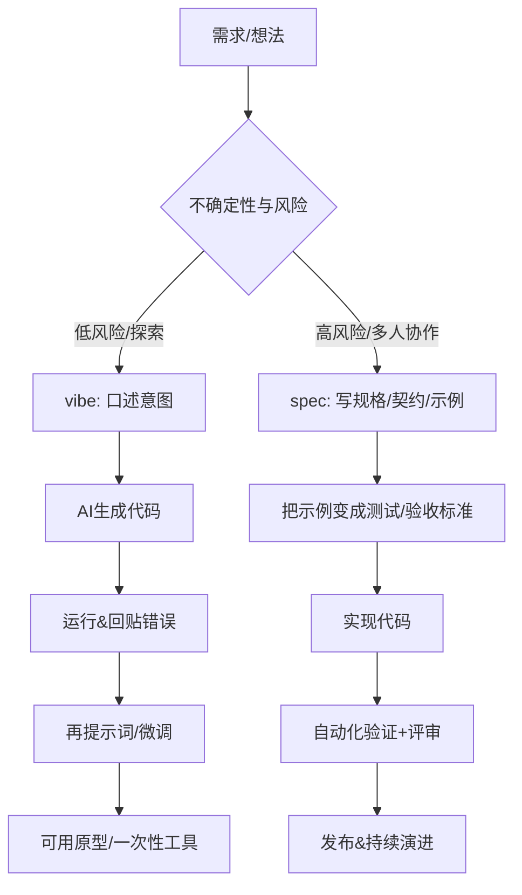

+++
date = '2026-03-27T17:00:00+08:00'
draft = false
title = 'Vibe coding VS Spec Coding'
description = "从“先跑起来”到“先说清楚"

image = 'cover.png'
+++


## 核心原则
一句话描述，Vibe Coding 强调用自然语言驱动 AI 快速生成与迭代代码，追求“先做出可运行的东西”。Spec Coding强调先把行为边界写清楚，再让实现与测试去对齐，从而降低协作与维护成本.


在学术/业界，“vibe coding”“spec coding”并无统一、稳定的标准定义；本文采用常见社区类比：

**vibe coding 的核心原则**：vibe=以直觉/体验驱动的 AI 生成式开发。概念通常追溯到在 2025 年前后对“把代码细节放到后台、用对话和反馈推进”的描述；实践上更像“多轮提示词→生成→运行→再提示词”的闭环，默认把大量实现细节交给模型，甚至不逐行阅读差异，以极快速度获得可用原型。
**spec coding 的核心原则**：spec=以规范/规格（契约、示例、可执行验收标准）驱动的开发，并在关键处以“API contract / Specification by Example”等成熟做法作为落地点来解释。先把“系统应该做什么”写成**可沟通、可检验**的规格（如 API 契约、示例驱动的验收标准、测试用例），再写实现去满足它。

## 典型工作流程与团队协作
Vibe Coding 更像“先产出→再修正”：目标清晰但规格未必完备时，用生成式改动快速逼近一个可运行版本；协作上往往依赖个人在对话中的隐性上下文与即时判断。
Spec Coding 更像“先对齐→再并行”：把输入输出、错误码、边界条件、验收例子变成显式工件（spec/tests），再允许多人并行实现与联调；契约还能驱动 mock、自动生成文档/SDK 等，从一开始就减少集成摩擦。



## 示例代码片段
下面用同一任务“把金额字符串转为分（int）”演示差异。

**Vibe Coding 风格（快，但把规则留到事后）**：常见于“先让它跑起来”，但隐含了浮点误差、舍入规则不明、异常输入处理缺失等风险。
```python
# vibe: 快速可用版（示意）
def to_cents_vibe(s: str) -> int:
    s = s.strip().replace(",", "")
    return int(float(s) * 100)  # 可能出现 0.29*100=28.999... 的问题
```

**Spec Coding 风格（先写清楚规则，再实现对齐）**：把“该如何舍入/允许什么输入/错误如何抛出”写进规格与测试，让后续维护者只需遵循工件即可。
```python
from decimal import Decimal, ROUND_HALF_UP

def to_cents_spec(s: str) -> int:
    """
    Spec:
    - 输入允许: "12", "12.3", "12.34", "1,234.56"
    - 规则: 四舍五入(ROUND_HALF_UP)到2位小数，再转分
    - 非法输入: 抛 ValueError
    """
    d = Decimal(s.replace(",", "").strip()).quantize(
        Decimal("0.01"), rounding=ROUND_HALF_UP
    )
    return int(d * 100)

def test_to_cents_spec():
    assert to_cents_spec("12") == 1200
    assert to_cents_spec("12.345") == 1235
    assert to_cents_spec("1,234.56") == 123456
```

## 优缺点对比
| 维度 | Vibe Coding（直觉/体验驱动） | Spec Coding（规格/契约驱动） |
|---|---|---|
| 目标 | 快速得到“能跑的东西” | 快速对齐“该跑成什么样” |
| 速度 | 上手快、试错快 | 前期慢一些，后期返工少 |
| 质量/安全 | 容易引入不可见缺陷与安全坑 | 规格+测试把质量前移、可审计 |
| 协作 | 易变成“只有提示词作者懂” | 规格工件成为共同语言与单一事实源 |
| 维护成本 | 原型可用，演进易失控 | 更利于长期演进与治理 |
| 适合结果形态 | 一次性工具、探索性原型 | 核心服务、可持续产品与平台 |

以上对“vibe 的快与风险”的判断，与对 vibe 的典型描述和其“更适合周末/一次性项目”的语境一致；对“spec 促进并行与减少集成摩擦”的判断，则与 API-first/contract-first 与示例驱动规格的实践总结一致。

## 适用场景、实践建议与常见陷阱
**适用场景**：vibe 更适合“不确定但低风险”的探索（内部小工具、交互原型、数据一次性脚本）；spec 更适合“改错代价高”的领域（支付/权限/合规、对外 API、多人长期维护的核心模块）。当组织要把 AI 生成代码带入生产，安全机构也提醒需要更强的保障与默认安全的工程措施。

**三条可立即实践的建议（可直接落地到团队流程）**：  
1) **先分级再选法**：把需求按“风险×寿命×协作规模”分三类（低/中/高）。低风险直接 vibe；中风险 vibe 但必须补最小规格（输入输出+3个边界例子）；高风险必须 spec（契约+测试+评审）。
2) **把规格压缩成一页**：为 spec coding 设一个“1-page spec”模板：目标、非目标、接口/状态、错误边界、5个示例（含反例）、验收标准；示例直接转成自动化测试或可执行验收。
3) **给 vibe 加护栏**：规定“Accept All 也行，但必须过关”：最少运行单测/静态检查；对外暴露接口必须补契约；关键路径引入变更必须有人类可读的差异摘要与回滚方案。

**常见陷阱与规避**：  
vibe 的典型陷阱是“能跑但没人说得清为什么能跑”，导致隐蔽 bug、维护困难与安全问题；规避要点是把不确定性留在探索期，把进入生产的部分迁移到可验证工件（测试/契约）上。
spec 的典型陷阱是“过度规格化”与“规格漂移”（实现变了但规格没更新）；规避要点是让规格可执行、纳入 CI，且规格变更必须和代码变更同 PR/同评审，让规格自然成为“活文档”。

## 参考

[What Is vibe coding?](https://cloud.google.com/discover/what-is-vibe-coding)
[Wiki: Vibe coding](https://en.wikipedia.org/wiki/Vibe_coding)
[Wiki: Spec-driven development](https://en.wikipedia.org/wiki/Spec-driven_development)
[Github: OpenSpec](https://github.com/Fission-AI/OpenSpec)
[Specification by Example](https://res.infoq.com/articles/specification-by-example-book/en/resources/SpecificationbyExampleCH12.pdf)

> 文档包含AI辅助生成内容